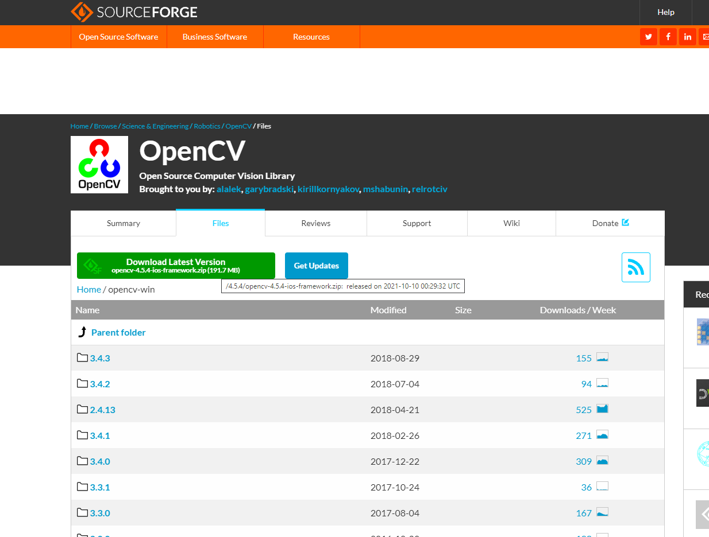
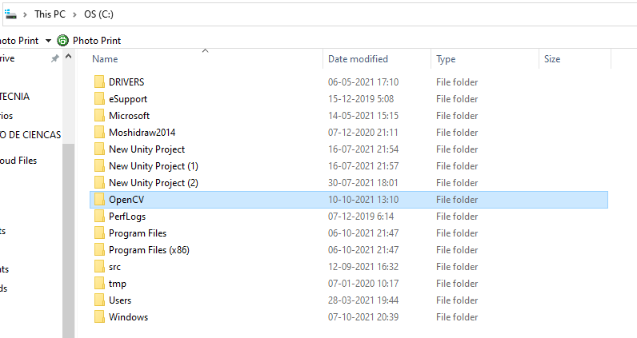
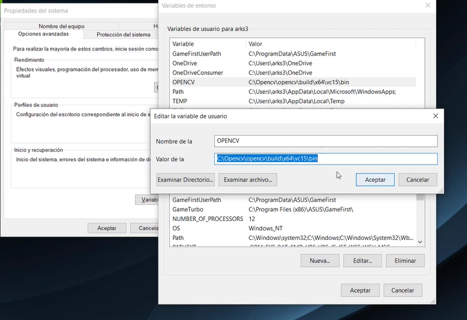
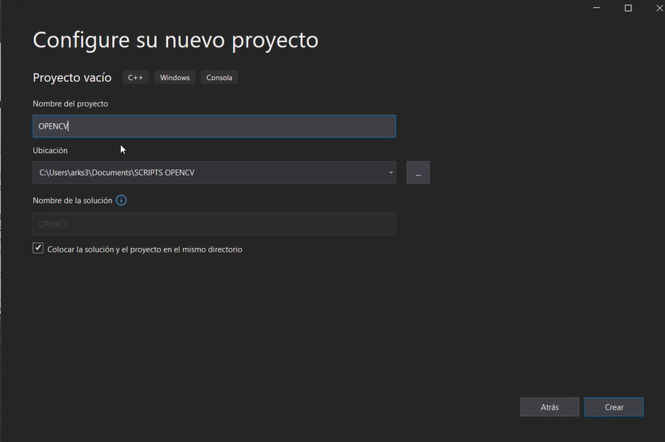
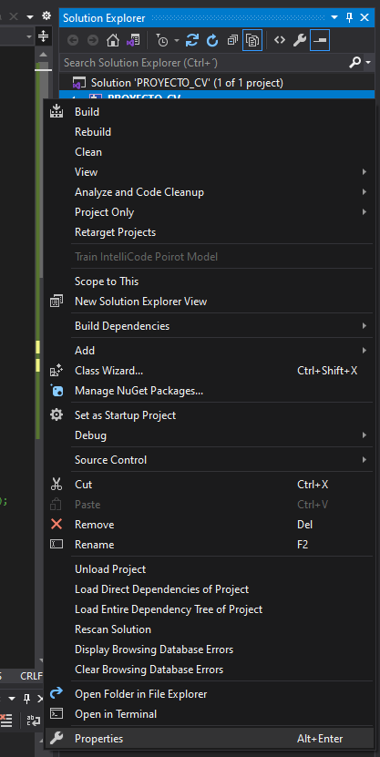
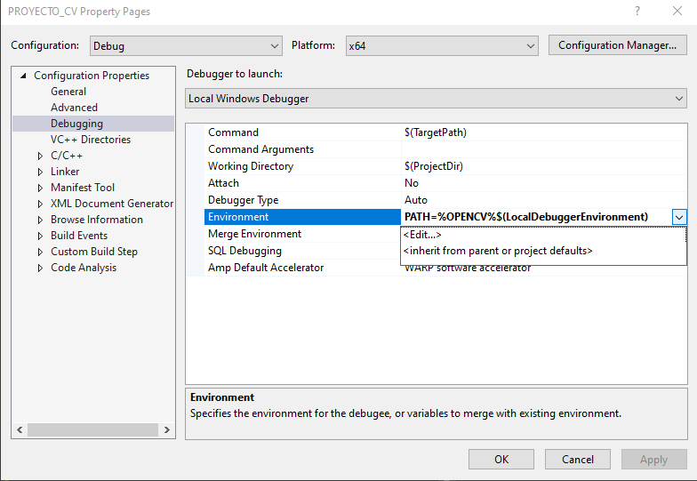
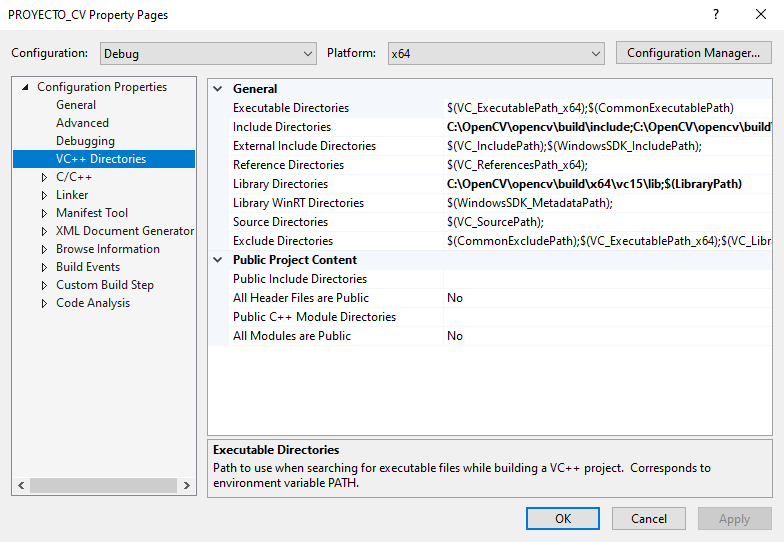
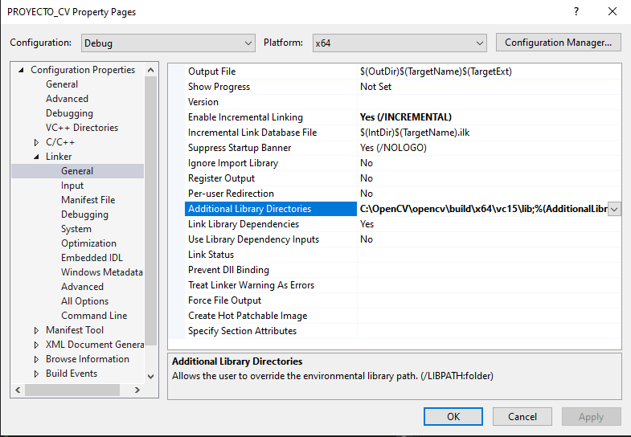
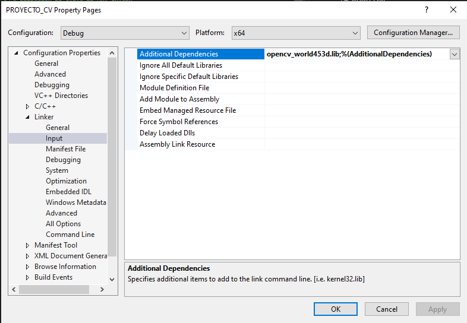
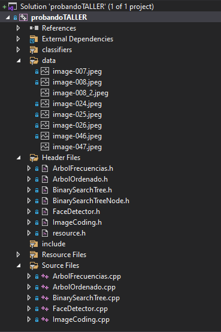

# Informe Técnico 
## Curso: Estructura de datos
### Detección y reidentificación de caras en secuencias de imágenes o video

**Alumnos:**

* Tamara Ossandón (Encargada de bitácora)
* Sebastian Ledezma (Coordinador)

## Resumen 

> En las graduales instancias de aprendizaje que se han dispuesto, tanto de manera autónoma o guiada, como primera instancia se realizó una retroalimentación de la materia respecto a la sintaxis del lenguaje de programación C y C++ y se investigó acerca del funcionamiento de las librerías de OpenCV para relacionar algunos algoritmos con los requerimientos de la primera historia de usuario a implementar. En segunda instancia, se realizó una capacitación necesaria sobre GitHub para poder tener control respecto a las versiones desarrolladas del programa y establecer una mejor organización y planificación del proyecto a nivel general, además de aprender lo básico en cuanto a la creación de  archivos y carpetas, y cómo interactuar con la plataforma. Posteriormente, se instaló una IDE de desarrollo (Visual Studio Code) y OpenCV, en donde se empezó a probar en la IDE distintos algoritmos que estuvieran relacionados a la detección de rostros en archivos multimedia, concluyendo así en el desarrollo del código que permite hacer seguimiento a cada identidad identificada en el video, señalándola con un marco de color rojo.

## 1. Introducción

El reconocimiento facial es una tarea que, si bien, parece difícil, hay algunos procesos ya continuados pre-construidos anteriormente para construir grandes esqueletos de procesamiento de información que pueden satisfacer grandes problemas de la sociedad, sobretodo últimamente en lo que respecta al reconocimiento e identificación facial, tema importante de seguridad y seguimiento que aporta tanto a las áreas de economía, seguridad, compras diarias, etc. Es por esto, que a través de OpenCV, se quiere construir un programa por el cual tenga como objetivo principal el reconocimiento facial para poder construir un sistema de vigilancia basado en este reconocimiento facial. Para ello, se cuenta con un dispositivo de adquisición, en el cual se deben detectar las caras de diferentes personas que aparecen en la grabación, haciendo un resumen de las iddentidades presentes y las estadísticas relacionadas a la duración de la exposición en el metraje.


### 1.1 Descripción del problema
El presente proyecto tiene como objetivo implementar un sistema desarrollado en el lenguaje de programación C++ y librerías de OpenCV, que conste en la detección de rostros faciales de un archivo multimedia que presenta distintas identidades, es por tanto, por lo que el se tiene que diseñar y desarrollar una inteligencia artificial la cual detecte cada rostro presente en el video señalándolo con un cuadro de color rojo alrededor de él. Además, se debe implementar diferentes funciones que tendrán un uso en el ámbito de la vigilancia, tales como; un listado de las personas (identidades) detectadas en un intervalo de tiempo definido en el video, y un listado de todas las identidades que se vieron expuestas en la grabación. Ambas, mostrando el número de cada identidad correspondiente y su duración efectiva de exposición. 

### 1.2 Objetivos

**Objetivo General**

Construir un sistema de vigilancia a través del reconocimiento de rostros, en donde, mediante una cámara o un video, se detecten los rostros de las diferentes personas que están presentes en la grabación, obteniendo diferentes datos y estadísticas relacionadas a las identidades identificadas.

**Objetivos específicos**

1.	Investigar el funcionamiento de las librerías de OpenCV para comprender el funcionamiento de los algoritmos relacionados al reconocimiento facial.
2.	Implementar las librerías de OpenCV utilizando el lenguaje de programación C++ para realizar el seguimiento e identificación facial.
3.	Señalar un marco de color rojo alrededor de cada rostro identificado para visualizar de mejor manera la identidad.
4.	Definir un código de identidad a cada rostro identificado para poder diferenciarlas entre las demás.
5.	Establecer intervalos de tiempo en la secuencia de video para obtener las diferentes identidades que se vieron identificadas específicamente en ese lapso.
6.	Obtener las cinco identidades que más tiempo fueron detectadas en la grabación.
7.	Crear un listado de todas las identidades detectadas indicando el tiempo total de las veces que aparecieron en la grabación.
8.	Comprobar el correcto funcionamiento del programa a través del uso de distintos archivos multimedia.


### 1.3 Solución propuesta

Respecto al diseño del programa, se trata de tratar a cada rostro como una identidad, por lo que, través de las librerías de OpenCV, se leerán las identidades del video y se almacenarán en una lista general de rostros, en las cuales cada identidad tendrá su imagen (captura del rostro) y tiempo de duración en el video. Es con estas características que podremos dar inicio a poder recorrer esta estructura para realizar distintas operaciones, por ejemplo capturar el rango de aparición de cada identidad, o la cantidad de apariciones en un tiempo determinado. De ser necesario, se crearán otras estructuras dinámicas para almacenar temporalmente algunos registros de identidades para usarlos en el problema solicitado.


## 2. Materiales y métodos

A través de las herramientas que ofrece OpenCV, se necesita implementar un tipo de elemento para guardar la información de cada cara identificada en los archivos multimedia. Es por esto, que se utilizará una estructura recursiva: Árboles binarios. Es en esta estructura en donde se alojará la información de cada rostro identificado. En un árbol, se guardarán las identidades únicas con una ID asociada, quedando conformado el árbol según la ID de cada imagen. En el otro árbol, la estructura estará dada por la frecuencia (cantidad de veces que aparece la identidad en el video/imagenes consecutivas), en donde se ordenará en relación a esta. Luego de guardar la información leída de los archivos multimedia, se hará una función que pueda obtener las 5 primeras identidades que tienen la mayor frecuencia, ordenadas mediante el recorrido específico denominado "InOrder", desplegando así los IDs asociados junto con su frecuencia de aparición. Es así, como tendremos lo necesario para completar el objetivo específico N°6.

### 2.1 Instalación

El entorno de desarrollo empleado para desarrollar el programa es Visual Studio Community (2019) y las librerías utilizadas son de OpenCV. Las librerías ofrecen una sólida base que están orientadas a la identificación de rostros e incluso la señalización de estas identidades ya sea en imágenes, videos multimedia o en webcam con Haar Cascades, CascadeClassifier y para su visualización el método "rectangle".

### 2.2 Diseño 

En el proyecto actual hay actualmente 5 módulos de implementación para hacer funcional el código, los cuales son los siguientes:

**Header files**: Contiene las clases con terminación ".h", es decir, contiene las interfaces de implementación de los archivos ".cpp", que son los siguientes:
1. ArbolFrecuencias.h
2. ArbolOrdenado.h
3. BinarySearchTree.h
4. BinarySearchTreeNode.h
5. FaceDetector.h
6. ImageCoding.h
7. NodoAVL.h
8. AVL.h

**Resource files**: Contiene la clase principal "main.cpp" que ejecuta e incluye a las demás clases ".h" para hacer funcionar el código principal.

**Source files**: Contiene la implementación de las clases definidas en el módulo "Header Files":

1. ArbolFrecuencias.cpp
2. ArbolOrdenado.cpp
3. BinarySearchTree.cpp
4. FaceDetector.cpp
5. ImageCoding.cpp
6. AVL.cpp

**datita**: Contiene los archivos multimedia que son sujetos a análisis en el código principal "main.cpp"

**classifiers**: Contiene el archivo "haarcascade_frontalface_alt.xml", el cual es un archivo con un enfoque de aprendizaje automático en donde su función radica a entrenarse a sí mismo a través del análisis de imágenes. Es por este archivo, por el que es posible detectar las identidades faciales en las imágenes analizadas.

**Clases implementadas**: 

1. ArbolFrecuencias: Clase que implementa un árbol y lo ordena según la frecuencia que tiene cada nodo que representa una identidad.
2. ArbolOrdenado: Clase que implementa un árbol y que por dentro define la similitud de la imagen analizada y la imagen por analizar. En la inserción de la imagen, se crea un nuevo nodo con la información de la identidad (Imagen, frecuencia, ID) y lo posiciona en la ubicación correspondiente en la estructura.
3. BinarySearchTree: Clase de guía (no influyente en el código principal) para implementar los árboles anteriores.
4. BinarySearchTreeNode: Clase que define la estructura de un nodo principal que contiene una variable para guardar el ID de la identidad, frecuencia de aparición e imagen. Posee además, dos nodos que representan los nodos hijos (izquierdo y derecho) del nodo presente.
5. FaceDetector: Clase que detecta las caras en una imagen, teniendo métodos internos como el aumento en el contraste de la imagen.
6. ImageCoding.h: Clase que procesa la imagen, convierte a grises, escala y ecualiza.
7. NodoAVL: Clase que defina la estructura de un nodo principal similar al BinarySearchTreeNode, con la diferencia que éste incluye una variable indicadora de altura.
8. AVL: Clase que implementa un árbol AVL balanceado, con sus procedimientos y métodos de balanceo, eliminación, inserción y despliegue de datos.


### 2.3 Implementación
A continuación se muestran las funciones que tuvieron más relevancia en términos de búsqueda y recorrida en un árbol, las cuales fueron cruciales para la impresión de las 5 identidades con más frecuencia.
La siguiente función devuelve la cantidad de nodos que contiene un árbol, en donde recibe como parámetro el nodo principal del árbol y una variable en donde se guardará la cantidad final de nodos. 
El funcionamiento consiste en recorrer recursivamente el árbol a través de la función, en donde cada vez que identifique un nodo, se incrementará la cantidad en 1.

```c++
1. void cantidad(BinarySearchTreeNode* root, int *cant)
2. {
3.    if (root != nullptr)
4.    {
5.        (*cant)++;
6.        cantidad(root->left, cant);
7.        cout << root->left << endl;
8.        cantidad(root->right, cant);
9.        cout << root->right << endl;
10.    }
11. }
```

La siguiente función imprime por consola el ID de las identidades identificadas a lo largo del programa. El orden de impresión es de la frecuencia menor a la frecuencia mayor.
```c++
1. void enOrden(BinarySearchTreeNode* root) {
2.    if (root != nullptr) {
3.        enOrden(root->left);
4.        cout << "ID de la imagen: " << root->key << " // Frecuencia: " << root->frec << endl;
5.        enOrden(root->right);          
6.    }
7. }
```

La siguiente función imprime por consola el ID de las 5 identidades, junto a su frecuencia. La implementación radica en el uso de la recursión para la búsqueda, y la omisión de la impresión de los valores que no corresponden (no son los primeros 5) a través del parámetro entero "omision" que como entrada tiene la diferencia entre la cantidad de elementos del árbol y la cantidad de identidades a mostrar, por lo que cada vez que encuentra un nodo se descontará una unidad hasta llegar a 0, en donde ahí sí puede mostrar las identidades restantes (y como está ordenado en orden, mostrará las últimas 5 con mayor frecuencia) 

```c++
1. void identidades(BinarySearchTreeNode* root, int *c, int omision, String *info5IdentidadesTxt, int * i) {
2. //6-5 = 1, a partir del 1 imprime
3.    if (root != nullptr) {
4.        identidades(root->left, c, omision, info5IdentidadesTxt, i);
5.        if (omision==0) {
6.            cout << "> ID de la imagen: " << root->key << " // Frecuencia de aparición: " << root->frec << endl;
7.            (*info5IdentidadesTxt) = (*info5IdentidadesTxt) + "\n ID: " + to_string(root->key) + ", Frecuencia de aparición: " + to_string(root->frec) + " veces";
8.            //Mat imgen = ;
9.            *i = *i + 1;
10.            imwrite("./identidades_mas_frecuentes/identidad_ID_"+ /*to_string(*i) + "_ID_" + */ to_string(root->key) + ".png", root->image);
11.            imshow("Rostros mas frecuentes", root->image);
12.            waitKey(1000);
13.        }
14.        else {
15.            omision--;
16.        }
17.        identidades(root->right, c, omision, info5IdentidadesTxt, i);
18.    }
```

La siguiente función inserta los nodos obtenidos del árbol "ArbolFrecuencias" de manera ordenada (InOrder) en el árbol "ArbolOrdenado" que está ordenado por frecuencias. Se utiliza la misma funcionalidad de la función "enOrden". Además, inserta la info de cada nodo de estos árboles en el árbol balanceado AVL definido.

```c++
1. void insertarNodosOrdenadosFrecuencia(BinarySearchTreeNode* &root, ArbolOrdenado &aoo, ArbolAVL &avl) {
2.    if (root != nullptr) {
3.        insertarNodosOrdenadosFrecuencia(root->left, aoo, avl);
4.        //cout << "[Insertando] ID: " << root->key << " // Frecuencia: " << root->frec << endl;
5.        aoo.insert(aoo.root,root);
6.        //cout << "INSERTANDO EN ARBOL AVL !!!!!!!!!!!" << endl;
7.        avl.insertar(root->key, root->frec, root->frames, root->image);
8.        //cout << "[Insertado] ID: " << avl.root->key << " // Frecuencia: " << avl.root->frec <<" // Frames: " << endl;
9.        insertarNodosOrdenadosFrecuencia(root->right, aoo, avl);
10.    }
11. }
```

La siguiente función crea un archivo txt en el directorio "identidades_registros_txt" que guarda la información de las identidades totales registradas en el metraje, y las identidades con mayor frecuencia de aparición. Son dos archivos por separado, los cuales se crearán según la indicación del string "decisión" , en donde si dice "total" se almacenarán **todas** las identidades en una carpeta, mientras que, si es al contrario, se guardarán en una carpeta aparte a la anterior en un archivo txt distinto, teniendo un mejor orden al momento de guardar estos archivos.

```c++
1. void escribirTxt(String s, String decision) {
2.    ofstream archivo;
3.    string info_principal;
4.    if (decision == "total") {
5.        archivo.open("./identidades_registros_txt/registro_identidades.txt", ios::out);
6.        info_principal = "---------- Registro total de identidades ----------";
7.    }
8.    else {
9.        archivo.open("./identidades_registros_txt/registro_identidades_frecuentes.txt", ios::out);
10.        info_principal = "---------- Registro de identidades frecuentes ----------";
11.    }
12.    if (archivo.fail()) {
13.        cout << "No se pudo abrir el archivo" << endl;
14.        exit(1);
15.    }
16.    archivo << info_principal;
17.    archivo << s;
18.    archivo.close();
19. }
```


#### Detector de caras

El siguiente código fue utilizado para la detección de identidades, el cual utiliza métodos y funciones de otras clases como "FaceDetect" o "ImageCoding", el cuales fueron descritos anteriormente en la sección de módulos y clases. Su funcionamiento se debe básicamente en el uso de un archivo entrenado en la identificación de rostros faciales, los cuales se almacenan en una variable de tipo Mat para luego codificarla y devolver un vector de tipo Rect, el cual se iterará posteriormente para la inserción en los árboles correspondientes.

```c++
1. FaceDetector::FaceDetector() : scaleFactor_(1.05), minNeighbors_(8), imageWidth_(50), imageHeight_(50) {
2.    face_cascade.load("C:/Users/jimimix/Desktop/datita/classifiers/haarcascade_frontalface_alt.xml");
3. }

4. std::vector<cv::Rect> FaceDetector::detectFaceRectangles(const cv::Mat& frame) {
5.    std::vector<cv::Rect> faces;
6.    Mat imageGray;    
7.    // Detecto las caras (Se debe pasar la imagen a escala de grises
8.    cvtColor(frame, imageGray, COLOR_BGR2GRAY);
9.    // Aumento el constraste de una imagen
10.    equalizeHist(imageGray, imageGray);
11.    face_cascade.detectMultiScale(imageGray,
12.        faces,
13.        scaleFactor_,
14.        minNeighbors_,
15.        0 | CASCADE_SCALE_IMAGE,
16.        Size(imageWidth_, imageHeight_));
17.    return faces;
18. }
```


## 3. Resultados obtenidos

Los resultados obtenidos coincidieron con el objetivo principal de la confección y modelamiento del programa, pues se logró diseñar un sistema de identificación de rostros, el cual guarde la información de cada identidad, su frecuencia de aparición en el metraje y la asignación de una ID para una mayor facilidad de reconocimiento. Esto, a través de estructuras de datos relacionadas al curso en sí, las cuales fueron óptimas para realizar el taller, pudiendo identificar y relacionar cada árbol estudiado para ver en qué situación se podía aplicar de una manera más eficiente.


## 4. Conclusiones

Si bien, la realización del programa se vio obstaculizada por un difícil ámbito acádemico que conllevó interrupciones abruptas en cuanto a trabajo y a las retroalimentaciones constantes en lo que avanzaba el curso, los objetivos de aprendizajes planteados inicialmente y la introducción a un nuevo concepto que respecta a reconocimiento facial fueron completados con mucho éxito. Se logró construir, a pesar de no tener alguna base anterior relacionada al mundo de la identificación de rostros, un modelo el cual completa su objetivo principal, que es identificar rostros de un metraje y almacenar la información obtenida de éste en distintas estructuras de datos, como listas enlazadas y árboles binarios, junto a sus derivados. En la realización de diseños y construcciones de prototipos, se pudieron identificar las diferencias de cada estructura de datos, pudiendo identificar cuál era la más indicada para cada situación, simplificando de mejor forma cada análisis e inserción de datos durante la ejecución del programa. Como análisis final, se invita a investigar y experimentar con librerías que parecen fuera de alcance por, tal vez, una complejidad elevada y una nula práctica al respecto, sin embargo, a través de las librerías y archivos ya entrenados, se hace menos complicado y más entretenido de lo que parece, por lo que solo queda experimentar con el mundo de la identificación, no sólo facial, sino a otros mecanismos de identificación, ya sea seguimiento de distintos objetios, sensores de movimiento, confección de objetivos pivot, u otros simuladores referidos a la identificación y movimiento.
# Anexos


## Anexo A: Instalación librerías OpenCV


Para la instalación de OpenCV, ingresar al link de la página oficial:
https://sourceforge.net/projects/opencvlibrary/files/opencv-win/


Al ingresar, hacer click en donde dice "page on Sourceforge" para ir al link de descarga.


Al cargar la página, hacer click en "Download Latest Version" y se pondrá automáticamente a descargar la última versión de OpenCV.



Una vez descargado, hay que crear una carpeta en disco C: llamada "OpenCV". Cuando haya descargado el archivo, se abre y se instala en ese directorio (C:\)



Ya instalado en la carpeta, hay que ir a modificar las variables de entorno del sistema. Para eso solo buscamos en el buscador "Edit the system environment variables" o en su defecto, "Editar las variables de entorno del sistema"


Una vez abierto, hacer click en "Variables de entorno" en la parte inferior y aparecerá un cuadro, en donde hay que darle a "Nueva" para asignar una nueva variable de entorno en donde ingresaremos el directorio donde se encuentra la carpeta de OpenCV, en el directorio de bin, tal como se muestra en la captura. Una vez realizado esto, aceptamos y cerramos.




## Anexo B: Instalación de IDE y configuración librerías OpenCV


Para instalar Visual Studio Community 2019, ingresar al siguiente link y hacer click donde dice "Descargar Visual Studio":
https://docs.microsoft.com/en-us/visualstudio/install/install-visual-studio?view=vs-2019


Luego, al redireccionar a otra página, hacer click en donde dice "Descarga gratuita" en la sección "Comunidad" y se pondrá a descargar el ejecutable. Una vez abierto, se instalará y pedirá que el computador se reinicie para finalizar la instalación.


Para configurar las librerías que ofrece OpenCV, creamos un nuevo proyecto.



Hacer click derecho en el nombre del archivo del proyecto, y clickear en propiedades.



Una vez abiertas las propiedades del proyecto, realizar las siguientes configuraciones que se muestran en las capturas (las marcadas en negrita) 






Y finalmente, para que reconozca lo previamente realizado utilizar el "x64" en la configuración de compilación, ya que si se ingresa otra no funcionará, puesto que las configuraciones se hicieron solo para x64.


## Anexo C: Visualización módulos del proyecto




# Referencias

Indicar los libros, páginas web, documentos, etc. Utilizados en el trabajo. Por ejemplo:

1. Computer Vision Zone. (2021, 14 julio). OpenCV C++. https://www.computervision.zone/courses/opencv-cv/
2. Márquez, J. C. C. (2019, 6 mayo). Instalar OpenCV con Visual Studio 2017. aprendiendo ingeniería. https://aprendiendoingenieria.es/instalar-opencv-con-visual-studio-2017/


